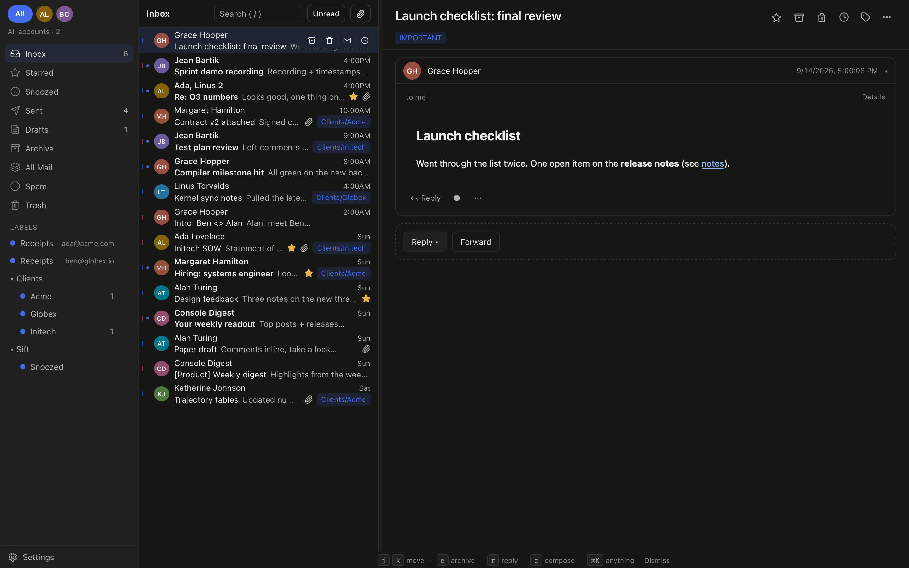

<p align="center"></p>
<h1 align="center">Sift</h1>
<p align="center">Fast, quiet Gmail for your Mac.</p>
<p align="center"><a href="https://usesift.xyz/download"><strong>Download for Mac</strong></a> · <a href="https://usesift.xyz">Website</a> · <a href="https://github.com/AadiXC0DE/Sift/releases/latest">Release notes</a></p>



<p align="center"><sub>The real Sift app, shown with a fictional demo mailbox.</sub></p>

Sift keeps your mailbox on your Mac, with fast local search and shortcuts for everyday triage. A Rust core and the Mac’s built-in WKWebView keep it lightweight. No bundled browser engine. No Sift mail server.

## A calmer inbox

- **All your Gmail accounts, together.** One unified inbox, with account colors and quick switching.
- **Move at your own pace.** Archive, snooze, labels, reminders, rules, undo, and a `⌘K` command palette.
- **Read mail as it was written.** Sender styles, tables, inline images, plain text, and collapsible quoted replies in a sandboxed reader.
- **Keep working offline.** Search your local mailbox and read cached messages. Drafts and queued changes sync when you reconnect; unopened message bodies still need a connection.
- **Stay in control.** Credentials in the macOS Keychain, no telemetry, and a choice before loading remote images. Updates download and install only when you ask.

## Get started

**macOS 13 or newer · Apple Silicon and Intel · Free beta**

1. [Download the latest DMG](https://usesift.xyz/download), open it, and drag **Sift** into **Applications**.
2. Turn on [Google 2-Step Verification](https://myaccount.google.com/signinoptions/two-step-verification).
3. Create an [app password](https://myaccount.google.com/apppasswords) named **Sift**. Enter your Gmail address and that password in the app.

Version 1.1.0 is **not Apple Developer ID signed or notarized**. Compare your download’s SHA-256 with the release’s `SHA256SUMS`; if macOS blocks opening it, use **System Settings → Privacy & Security → Open Anyway**. Updates use Sift’s separate cryptographic signing key.

No Google Cloud project is needed for app-password setup. Optional OAuth setup is documented in [docs/oauth.md](docs/oauth.md).

## A few keys go a long way

| Key             | Action                          |
| --------------- | ------------------------------- |
| `j` / `k`       | Move through the inbox          |
| `e` / `#`       | Archive / trash                 |
| `s` / `h` / `l` | Star / snooze / label           |
| `r` / `a` / `f` | Reply / reply all / forward     |
| `c` / `/`       | Compose / search                |
| `⌘K` / `?`      | Command palette / shortcut help |

Bindings can be remapped in Settings. [All shortcuts →](https://usesift.xyz/shortcuts)

## Your mail stays yours

Mail goes directly to Google over TLS. Credentials stay in the macOS Keychain, never in the mailbox database. Sift has no analytics service, crash reporting service, ads, or mail backend.

New installations ask before loading sender-hosted images. GitHub provides update checks and downloads; automatic checks can be disabled in **Settings → Updates**. [Privacy details →](https://usesift.xyz/privacy)

## Build and contribute

Requires macOS, Node 20+, pnpm 9+, and stable Rust.

```sh
pnpm install
pnpm tauri dev
```

```sh
pnpm lint
pnpm test
pnpm e2e
cargo test --manifest-path src-tauri/Cargo.toml
cargo clippy --manifest-path src-tauri/Cargo.toml --all-targets -- -D warnings
```

For a fictional demo mailbox, launch with `SIFT_DEMO=1` and a separate `SIFT_DATA_DIR`. Keep Rust and TypeScript DTOs in sync when contributing; CI checks them.

[Architecture](docs/architecture.md) · [Release process](docs/release.md) · [Verification record](docs/acceptance-dossier.md) · [Report an issue](https://github.com/AadiXC0DE/Sift/issues)

## License

Sift is open source under the [MIT License](LICENSE). You may use, modify and redistribute it, including in closed-source builds, provided the copyright notice and the license text travel with it. Issues and pull requests are welcome on [GitHub](https://github.com/AadiXC0DE/Sift).
